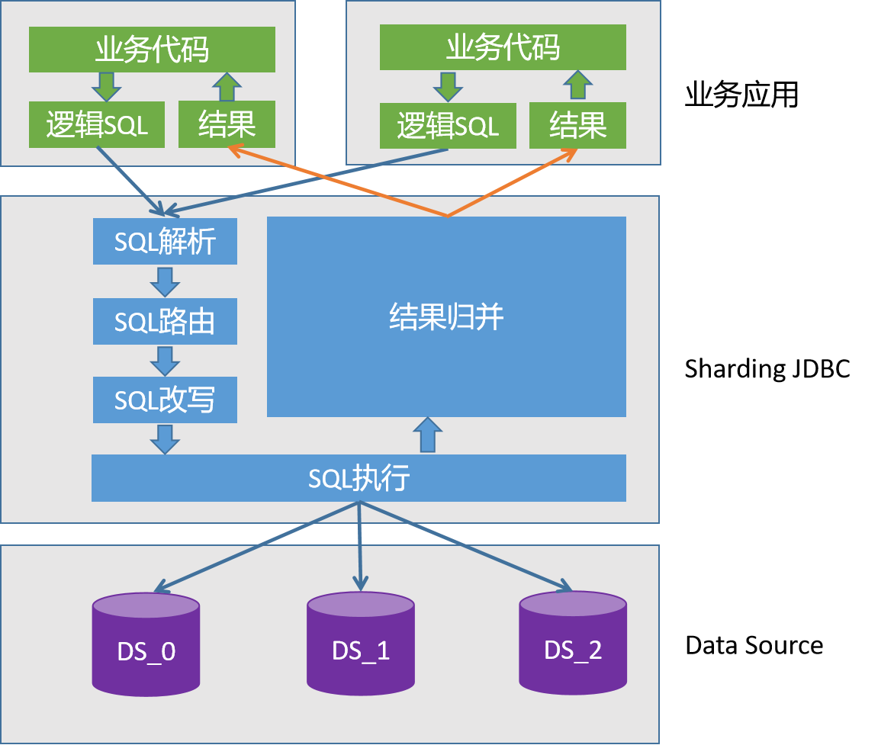

# shardingsphere
shardingSphere分库分表 
利用shardingSphere实现分库分表

推送项目到远程分支
git init  
git add -A
git commit -m "这是注释:初始化项目"
远程git建立好项目
git remote add origin https://gitee.com/kingCould/HelloWord.git
git push origin 分支名称

分析:
https://blog.csdn.net/zuoshengdong/article/details/106454888?spm=1001.2101.3001.6650.1&utm_medium=distribute.pc_relevant.none-task-blog-2%7Edefault%7ECTRLIST%7ERate-1-106454888-blog-97152210.pc_relevant_paycolumn_v3&depth_1-utm_source=distribute.pc_relevant.none-task-blog-2%7Edefault%7ECTRLIST%7ERate-1-106454888-blog-97152210.pc_relevant_paycolumn_v3&utm_relevant_index=1
